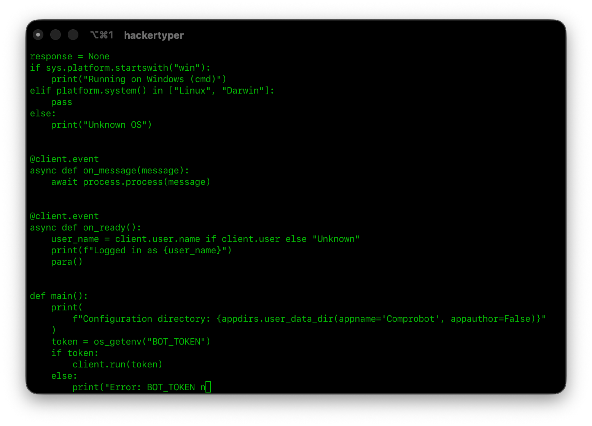

# hackertyper

A local CLI alternative to [hackertyper.net](https://hackertyper.net). Press any key and watch text stream across your terminal.



---

## Install

### Prerequisites

Rust 1.85+ is required (uses the 2024 edition). If you don't have it:

```bash
# Linux / macOS / WSL
curl --proto '=https' --tlsv1.2 -sSf https://sh.rustup.rs | sh
```

```bash
# macOS with Homebrew
brew install rust
```

Check your version with `rustc --version`, update with `rustup update stable`.

### Quick Install

```bash
cargo install hackertyper
```

Installs to `~/.cargo/bin/hackertyper`. Make sure that's on your `PATH` (rustup adds it automatically).

### Build from Source

```bash
git clone https://github.com/badluma/hackertyper
cd hackertyper
cargo install --path .
```

---

## Platform Support

**Linux & macOS:** Fully supported.

**Windows:** Not supported natively — `getch-rs` depends on `nix`, which is Unix-only. Use [WSL2](https://learn.microsoft.com/en-us/windows/wsl/install) and follow the Linux steps above.

---

## Usage

```bash
hackertyper --path <file>
```

Press any key to advance. `Ctrl+C` to quit.

## Options

| Flag | Short | Default | Description |
|------|-------|---------|-------------|
| `--path` | `-p` | required | File to type out |
| `--speed` | `-s` | `4` | Characters printed per keypress |
| `--color` | `-c` | `default` | Output color |
| `--loop` | `-l` | `false` | Loop the file continuously |

## Colors

`black` `red` `green` `yellow` `blue` `magenta` `cyan` `white`

`light_black` `light_red` `light_green` `light_yellow` `light_blue` `light_magenta` `light_cyan` `light_white`

## Examples

```bash
# Default speed
hackertyper -p /path/to/file

# Fast, green, looping
hackertyper -p /path/to/file -s 8 -c green -l

# Slow and dramatic
hackertyper -p /path/to/file -s 1 -c red
```

## License

MIT
